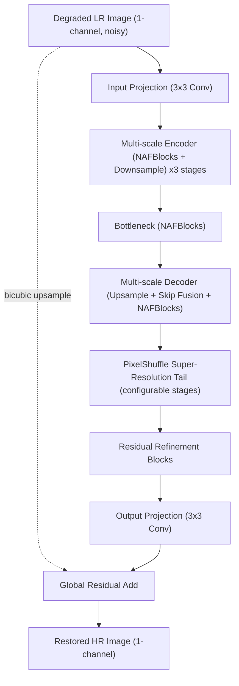

# KLA/i4C Hackathon — AI-Based Restoration of Degraded Semiconductor Images

A single unified deep-learning model that takes a **noisy, low-resolution, single-channel semiconductor inspection image** (speckle noise, Gaussian noise, and/or downsampling — often several at once) and outputs a **clean, high-resolution restoration**, matching a ground-truth image, at a fixed learned scale factor (128→256 or 256→512).

This repository is a complete, trainable, evaluable, submission-ready implementation — not a design sketch. Every component described below is implemented in `.py` files under this directory.

---

## 1. Project Overview

**Problem.** Semiconductor inspection images arrive degraded by a mix of speckle noise, Gaussian noise, and reduced spatial resolution. A single model must jointly denoise and super-resolve them while preserving real structure (no over-smoothing, no hallucinated detail) and generalizing to inspection tools/sources it never saw during training.

**Approach.** One network — **NAFSR** (NAFNet-style denoising backbone + PixelShuffle super-resolution tail) — performs denoising and super-resolution in a single forward pass, trained with a composite loss (Charbonnier + SSIM + gradient + frequency, perceptual optional) that specifically targets edge preservation and high-frequency recovery rather than only pixel-wise averaging (which is what causes over-smoothing).

---

## 2. Architecture

### 2.1 Why NAFSR (and not Restormer / SwinIR / RCAN / EDSR / plain U-Net)

| Candidate | Verdict |
|---|---|
| **SwinIR / Restormer** | Strong quality via (windowed/channel) self-attention, but attention adds real latency/memory, and semiconductor images are dominated by local, repetitive texture rather than long-range dependencies — the regime where attention pays for itself least. Not worth the H100 inference budget here. |
| **RCAN / EDSR** | Excellent super-resolution baselines, but built for *clean* bicubic-downsampled input — no denoising capacity, so a second network would be needed, breaking the "single unified model" goal. |
| **Plain U-Net** | Solid denoiser, but tends to blur during upsampling and has no feature-recalibration mechanism. |
| **NAFNet** ("Nonlinear Activation Free Network") | State-of-the-art *denoising* quality at a fraction of attention-model FLOPs — depthwise convs + a channel-split multiplicative gate ("SimpleGate") + Simplified Channel Attention (SCA: global-pool + 1×1-conv, no softmax) replace both nonlinear activations and full attention. Best speed/quality trade-off available for the denoising half. |

**Decision:** use a NAFNet-style encoder–decoder (U-Net topology, NAFBlocks, skip connections) as the denoising backbone, then attach a PixelShuffle super-resolution tail with a few residual refinement blocks. Everything shares one forward pass and one set of weights — this is **not** a two-stage cascade of separate models. `scale_factor` is implemented as a configurable number of PixelShuffle stages (any power of two: 1 = denoising-only ablation, 2 = 128→256 / 256→512, 4 = 128→512).

**Global residual learning:** the network predicts a residual added to a bicubic upsample of the (unclamped, normalized) degraded input, rather than reconstructing the image from scratch. This speeds convergence and dedicates capacity to genuine high-frequency recovery instead of relearning low-frequency content that bicubic upsampling already gets mostly right — directly reducing the over-smoothing failure mode called out in the problem statement.

### 2.2 Pipeline diagram



### 2.3 Model internals

- **NAFBlock**: `LayerNorm2d → 1x1 Conv (expand) → 3x3 Depthwise Conv → SimpleGate → SCA → 1x1 Conv (project) → learnable residual scale`, followed by an FFN-style second half of the same shape. No ReLU/GELU/softmax attention anywhere in this block — it is the main source of the speed advantage.
- **Encoder/decoder**: 3 stages by default (`model.enc_blocks: [2,2,4]`, `model.dec_blocks: [2,2,2]`), stride-2 conv downsampling, PixelShuffle-based upsampling, skip connections fused via 1×1 conv.
- **SR tail**: `log2(scale_factor)` PixelShuffle stages at `base_channels`, each followed by GELU, then `refine_blocks` more NAFBlocks before the final 1×1→1-channel projection.
- **Flexible input size**: the encoder pads to a multiple of `2^num_downsample_stages` with reflect-padding and crops back before the SR tail, so arbitrary (non-power-of-2) input resolutions work without manual tiling.

Default config (`config/config.yaml`): `base_channels=48`, giving ≈7M parameters at scale=2 — small enough for fast H100 inference, large enough for meaningful denoising capacity. All of this is configurable.

---

## 3. Intensity Handling — read this before training

Degraded semiconductor images can contain pixel intensities that **exceed the ground-truth dynamic range** (multiplicative speckle noise creates bright spikes above the clean signal ceiling). Naively clamping/min-max-normalizing the input before the model sees it would destroy exactly the information a denoiser needs ("this is a spike, not a real bright structure").

Two different, individually consistent rules are used (`utils/image_utils.py`):

1. **Ground truth** (clean by construction) — normalized with a **fixed**, bit-depth-derived divisor (255 for 8-bit, 65535 for 16-bit). Fixed and dataset-consistent, since GT never has the out-of-range problem, and a stable target space matters for loss computation and cross-image PSNR/SSIM comparability.
2. **Degraded input** — normalized with **per-image robust percentile statistics** (default 0.5th/99.5th percentile), **without clamping** the result:
   `x_norm = (x - p_low) / (p_high - p_low + eps)`.
   Because the result is not clipped, a speckle spike above the 99.5th percentile maps to a value `> 1.0` instead of being truncated to `1.0`. The first convolution layer therefore sees the true relative magnitude of every pixel. Percentiles (not raw min/max) are used so a single hot pixel can't dominate the scale, while still leaving outliers visibly unclamped in the normalized signal.

The model is trained to regress directly into the GT's fixed-normalized space, so its **output** is safely clipped to `[0, 1]` only at the very last step (a correctly restored image should indeed lie in the clean dynamic range) — this is the only clipping point in the entire pipeline. `evaluate.py` / `inference.py` use the exact same `normalize_degraded()` function as `train.py`, guaranteeing train/test consistency. The normalization method is configurable (`normalization.method: percentile | minmax | fixed` in `config/config.yaml`).

**This dataset specifically:** the KLA `.npy` drop in `datasets/train/` arrives **already pre-normalized** — `GT/*.npy` is strictly float32 in `[0, 1]`, while `NoisyLR/*.npy` is mostly in `[0, 1]` but with noise pushing values below `0` and above `1` (confirmed by `validate_dataset.py`, e.g. min `-0.28`, max `1.91` on a sample). For pre-normalized float data like this, `normalization.method: fixed` with `fixed_range: [0.0, 1.0]` is the correct default — it's an identity mapping (`(x - 0) / (1 - 0) = x`) that still performs **no clipping**, so the noise-driven excursions are preserved exactly as delivered rather than being rescaled per image. If you later train on raw 8-/16-bit images (PNG/TIFF) instead, switch to `method: percentile`, which computes per-image robust min/max from the degraded image itself.

---

## 4. Degradation-Aware Training

`datasets/augmentations.py` applies two layers, both configurable:

1. **Geometric** (identical on LR+HR to keep pairing exact): random crop, horizontal/vertical flip, 90° rotation.
2. **Synthetic degradation** (input only, applied with probability `augmentation.synthetic_prob`, layered on top of the real pairs — never replacing them): extra Gaussian noise, extra multiplicative speckle noise, mild Gaussian blur, brightness/contrast jitter. This diversifies the noise statistics the model sees so it generalizes better to out-of-distribution noise levels/sources, without resorting to unrealistic augmentations (no cutout/mixup/elastic warp) that would distort real semiconductor structure.

All strengths are configurable under `augmentation:` in `config/config.yaml`.

---

## 5. Loss Function

```text
L_total = w1*L_charbonnier + w2*L_ssim + w3*L_gradient + w4*L_frequency + w5*L_perceptual
```

| Term | Purpose | Default weight |
|---|---|---|
| Charbonnier (`losses/restoration_loss.py:CharbonnierLoss`) | Robust smooth-L1 pixel loss; far less sensitive to speckle outlier pixels than MSE | 1.0 |
| SSIM | Structural/luminance/contrast similarity; counteracts the "blurry average" look of pure pixel losses | 0.3 |
| Gradient (Sobel) | L1 on gradient magnitude; directly penalizes edge/structure mismatch → preserves real patterns, resists over-smoothing | 0.2 |
| Frequency (FFT magnitude) | L1 on 2D FFT magnitude; pushes the network to match high-frequency spectral content instead of only a spatial-domain average | 0.1 |
| Perceptual (VGG16, channel-replicated) | **Off by default (weight 0.0).** VGG is trained on natural RGB photographs; grayscale semiconductor imagery is out of that domain, and channel-replicating 1→3 channels doesn't fix the mismatch. Left available for experimentation (`loss.perceptual.weight > 0`), but the gradient + frequency terms are the domain-appropriate substitute and are on by default. | 0.0 |

All weights configurable in `config/config.yaml -> loss`.

---

## 6. OOD Generalization Measures

- Strong-but-realistic augmentation and synthetic degradation randomization (above)
- AdamW weight decay + gradient clipping
- **EMA** (exponential moving average of weights, decay configurable) — validated/checkpointed model uses the EMA copy by default
- Early stopping on validation PSNR (patience configurable)
- Validation-based checkpointing (never selects on training loss)
- Optional test-time flip self-ensemble (`--use_tta` in `evaluate.py`), off by default for speed, since it's a 4x inference cost

---

## 7. Repository Structure

```text
kla-image-restoration/
├── README.md
├── requirements.txt
├── train.py                 # training entry point
├── evaluate.py               # CRITICAL: standalone dataset evaluation + restoration
├── inference.py               # lightweight production inference (no metrics overhead)
├── validate_dataset.py        # dataset validation CLI
├── config/config.yaml         # every hyperparameter lives here
├── models/restoration_model.py  # NAFSR architecture
├── losses/restoration_loss.py   # composite loss
├── datasets/                  # dataset-loading CODE (paired_dataset.py, augmentations.py)
│   ├── train/                 #   + the actual data (git-ignored, see section 9): GT/, NoisyLR/
│   └── Test_NoisyLR/          #   + degraded-only test data (git-ignored)
├── metrics/metrics.py         # PSNR / SSIM / LPIPS / benchmarking
├── utils/                     # config, image I/O+normalization, checkpoint/EMA, logging
├── scripts/                   # train.sh, evaluate.sh, comparisons, bicubic baseline, ablation
├── weights/                   # trained checkpoints (git-ignored, see weights/README.md)
├── outputs/restored/, outputs/comparisons/, outputs/test_restored/
├── notebooks/visualization.ipynb   # visualization only — no core logic
├── tests/make_synthetic_dataset.py # smoke-test data generator
└── docs/hackathon_content.md
```

---

## 8. Installation

### Linux / macOS
```bash
git clone <repo-url>
cd kla-image-restoration
python -m venv venv
source venv/bin/activate
pip install -r requirements.txt
```

### Windows (PowerShell)
```powershell
git clone <repo-url>
cd kla-image-restoration
python -m venv venv
venv\Scripts\Activate.ps1
pip install -r requirements.txt
```

GPU users: install the CUDA build of PyTorch matching your driver (see https://pytorch.org/get-started/locally/) instead of the default PyPI wheel if `requirements.txt`'s torch doesn't pick up CUDA automatically.

---

## 9. Dataset Structure

This repository's `datasets/` directory does double duty: it holds the dataset-loading **source code** (`paired_dataset.py`, `augmentations.py`, `__init__.py`) *and*, as delivered for this project, the **actual data**:

```text
kla-image-restoration/
└── datasets/
    ├── __init__.py, paired_dataset.py, augmentations.py   # dataset-loading code (tracked in git)
    │
    ├── train/                       # → split 80/20 into TRAIN + VALIDATION (never touches test)
    │   ├── GT/                      #   3200 clean images, 256x256, float32 .npy, range [0,1]
    │   │   ├── 000000.npy
    │   │   └── ...
    │   └── NoisyLR/                 #   3200 degraded images, 128x128, float32 .npy
    │       ├── 000000.npy           #   (paired 1:1 with GT by filename stem; range extends outside [0,1] -- noise, NOT clipped)
    │       └── ...
    │
    └── Test_NoisyLR/                # → FINAL INFERENCE ONLY, never used for train/val
        ├── 000000.npy               #   400 degraded images, 128x128, no ground truth provided
        └── ...
```

```text
datasets/train/           datasets/Test_NoisyLR/
     ↓                            ↓
Train (80%) + Validation (20%)    Final Inference/Test
     ↓                            ↓
 train.py                     evaluate.py / inference.py
     ↓                            ↓
weights/best_model.pth  →   outputs/test_restored/
```

**Auto-detection, not hard-coded assumptions.** `datasets/paired_dataset.py:detect_split_folders` inspects the immediate subfolders of `data.train_dir` and classifies each as degraded-side or GT-side by name (`NoisyLR`/`degraded`/`noisy`/`LR`/`input` vs. `GT`/`ground_truth`/`clean`/`HR`/`target`, case-insensitive) — for this drop that resolves to `NoisyLR` (degraded) / `GT` (ground truth). Filenames are then paired by **stem** (extension-independent), and each pair's own scale factor is measured from its actual shape (`GT.shape[0] / NoisyLR.shape[0]`) rather than assumed uniform — confirmed 2× (128→256) across this dataset by `validate_dataset.py`. PNG, JPG/JPEG, BMP, TIFF, and raw NumPy **`.npy`** arrays are all supported.

**Train/validation split.** `datasets/paired_dataset.py:build_train_val_split` sorts all matched pairs by filename, shuffles them with a seeded RNG (`data.seed`, default 42), and slices off `data.validation_split` (default 0.2) — every pair lands in exactly one split, so there is no leakage. `datasets/Test_NoisyLR/` is never part of this split; it has no ground truth and is loaded exclusively by `evaluate.py`/`inference.py`.

Paths and split ratio are fully configurable in `config/config.yaml -> data` (`root`, `train_dir`, `test_dir`, `validation_split`, `seed`) or via `--set data.train_dir=...` overrides; nothing is hard-coded.

Large data files (`datasets/train/`, `datasets/Test_NoisyLR/`, `datasets/*.zip`) are **git-ignored** — only the `.py` source files under `datasets/` are tracked (see `.gitignore`).

Validate/inspect before training:
```bash
python validate_dataset.py --config config/config.yaml
```
prints a `DATASET SUMMARY` (pair counts, resolutions, detected scale factor, format, missing/corrupted files) plus intensity statistics (min/max/mean/std) per split.

---

## 10. Training

```bash
python train.py --config config/config.yaml
```

Override any hyperparameter without editing the file:
```bash
python train.py --config config/config.yaml --set training.epochs=100 training.batch_size=32 model.base_channels=64
```

Implements AdamW, cosine LR schedule with warmup, mixed precision (`torch.amp`), gradient clipping, gradient accumulation, EMA, early stopping, validation-based checkpointing (`weights/best_psnr.pth`, `best_ssim.pth`, `last_model.pth`, and `best_model.pth` — auto-selected per `training.select_best_metric`), automatic resume from `last_model.pth`, TensorBoard + CSV logging.

```bash
tensorboard --logdir runs/
```

---

## 11. Evaluation

**This is the primary deliverable script — it works as-is, no code edits required.**

```bash
python evaluate.py \
    --input_dir ./datasets/Test_NoisyLR \
    --output_dir ./outputs/test_restored \
    --weights ./weights/best_model.pth
```

- Loads the architecture from the config embedded in the checkpoint (falls back to `--config` if absent) — no manual architecture flags needed.
- Detects each input image's resolution independently and produces the correct learned (not bicubic) output resolution.
- Runs on GPU automatically if available, falls back to CPU otherwise; uses `torch.inference_mode()` + optional AMP.
- Preserves filenames **and format** — `.npy` inputs (like `datasets/Test_NoisyLR/`) produce `.npy` outputs; PNG/TIFF inputs produce PNG/TIFF outputs.
- `datasets/Test_NoisyLR/` has no ground truth, so PSNR/SSIM/LPIPS are **not** computed for it — evaluate.py reports pure inference statistics instead (images processed, average/total inference time, throughput). Pass `--gt_dir` explicitly if you do have a paired ground-truth directory (e.g. to re-check the validation split).
- Reports model load time, warm-up time, and per-image inference time **separately**, plus throughput, parameter count, and model size.

For pure production restoration without the dataset-validation/metrics overhead, use `inference.py` (same normalization, same architecture loading):
```bash
python inference.py --input ./datasets/Test_NoisyLR --output_dir ./outputs/test_restored --weights ./weights/best_model.pth
```

---

## 12. Metrics

- **PSNR** (`skimage.metrics.peak_signal_noise_ratio`): pixel-fidelity in dB, computed on GT-normalized `[0,1]` single-channel arrays.
- **SSIM** (`skimage.metrics.structural_similarity`): structural similarity, same normalized space.
- **LPIPS** (`lpips` package, AlexNet backbone): learned perceptual distance. Grayscale images are channel-replicated (`L → RGB` by repetition) and rescaled `[0,1] → [-1,1]` before being passed in, matching what the pretrained backbone expects — see `metrics/metrics.py:LPIPSMetric`. Note LPIPS' backbone is itself trained on natural images, so treat absolute LPIPS values on semiconductor imagery as a *relative* comparison tool between model variants rather than an absolute quality guarantee.
- Also reported by `evaluate.py`: average inference time/image, images/sec, parameter count, model size (MB), peak GPU memory (when on CUDA).

---

## 13. Visualization & Ablation

All three default to the **same config-driven validation split** train.py uses (`data.train_dir` + `validation_split` + `seed`), so they're automatically evaluated on data the model never trained on — pass `--degraded_dir`/`--gt_dir` explicitly to point at a different directory instead.

```bash
# Side-by-side (Degraded | Bicubic | Restored | GT) grids + zoomed high-detail crops
python scripts/generate_comparisons.py --weights weights/best_model.pth --output_dir outputs/comparisons

# Zero-training bicubic baseline for comparison
python scripts/bicubic_baseline.py --config config/config.yaml --output_dir outputs/restored/bicubic_baseline

# Multi-model ablation table (PSNR / SSIM / LPIPS / inference time)
python scripts/ablation_study.py --config config/config.yaml \
    --model bicubic:none --model unified:weights/best_model.pth \
    --output_csv outputs/ablation_results.csv
```
`scripts/ablation_study.py`'s docstring explains how to produce the "denoising-only" and "SR-only" variants for the full 5-row ablation table (train with `model.scale_factor=1`, or with noise augmentation disabled, respectively) — this harness computes results, it does not fabricate them.

---

## 14. Hardware

```text
GPU:              [RUN AFTER TRAINING]
CUDA:             [RUN AFTER TRAINING]
PyTorch:          2.13+ (see requirements.txt for the pinned floor)
Training time:    [RUN AFTER TRAINING]
Model parameters: [RUN AFTER TRAINING]  (≈7M at default base_channels=48, scale=2)
Model size:       [RUN AFTER TRAINING]
Inference time:   [RUN AFTER TRAINING]  (evaluate.py reports this automatically)
```

No PSNR/SSIM/LPIPS/timing numbers are fabricated anywhere in this repository — every metric placeholder above and in `docs/hackathon_content.md` is filled in by actually running `train.py` / `evaluate.py` on the real KLA dataset.

---

## 15. Reproducibility

- `experiment.seed` (config) seeds Python's `random`, NumPy, and PyTorch (CPU+CUDA) via `utils/logger.py:set_seed`. `experiment.deterministic: true` additionally forces deterministic cuDNN kernels (slower).
- `data.seed` independently seeds the **train/validation split** (`datasets/paired_dataset.py:split_pairs`) — the same seed always produces the same 80/20 partition of `datasets/train/`, so validation results are comparable run-to-run and there is never leakage between splits.
- The exact resolved config used for a run is saved to `runs/<experiment_name>/resolved_config.yaml` and embedded directly inside every checkpoint (`checkpoint["config"]`), so `evaluate.py`/`inference.py` always reconstruct the exact architecture without manual flags — even months later, even with a modified `config/config.yaml`.
- `requirements.txt` pins minimum versions for every dependency.

---

## 16. Model Weights

Trained checkpoints go in `weights/` (see `weights/README.md`) and are **git-ignored** (`*.pth`) because they typically run tens–hundreds of MB. Distribute a trained checkpoint via **Git LFS**, the **Hugging Face Hub**, or a **Google Drive / cloud bucket link** — pick whichever your grader/team can access most easily, and link it in `weights/README.md` once you have a trained model.

---

## 17. Full Command Reference

```bash
# 1. Install
pip install -r requirements.txt

# 2. Validate/inspect the dataset (prints the DATASET SUMMARY block)
python validate_dataset.py --config config/config.yaml

# 3. Train (auto-splits datasets/train/ 80/20, never touches Test_NoisyLR)
python train.py --config config/config.yaml

# 4. Evaluate on the held-out test set (the critical, as-is script)
python evaluate.py --input_dir ./datasets/Test_NoisyLR --output_dir ./outputs/test_restored --weights weights/best_model.pth

# 5. Comparison images (defaults to the same validation split used in training)
python scripts/generate_comparisons.py --weights weights/best_model.pth

# 6. Benchmark inference speed
python inference.py --input ./datasets/Test_NoisyLR --output_dir ./outputs/test_restored --weights weights/best_model.pth

# 7. Smoke-test the whole pipeline on synthetic data (no real dataset needed)
python tests/make_synthetic_dataset.py --root tests/synthetic_dataset
python train.py --config config/config.yaml --set data.train_dir=tests/synthetic_dataset/train data.test_dir=tests/synthetic_dataset/Test_NoisyLR training.epochs=2
```
