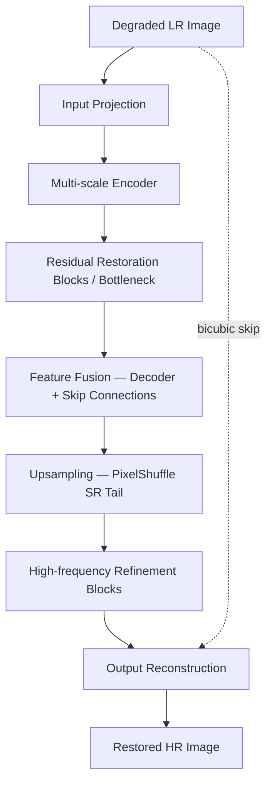

# Hackathon Presentation Content — KLA/i4C: AI-Based Restoration of Degraded Images

Concise, presentation-ready content for a 9-slide deck. Placeholders marked `[FILL IN]` need team-specific info; placeholders marked `[RUN AFTER TRAINING]` must be filled with real numbers from `train.py`/`evaluate.py` output — **never fabricate these**.

---

## Slide 1 — Team Details

- **Team name:** [FILL IN]
- **Members:** [FILL IN — name, role, e.g. "Model architecture & training", "Data pipeline & evaluation", "Presentation & documentation"]
- **Track:** KLA/i4C Hackathon — AI-Based Restoration of Degraded Images
- **Date:** [FILL IN]

---

## Slide 2 — Problem Statement

- Semiconductor inspection images are frequently **degraded**: speckle noise, Gaussian noise, and reduced spatial resolution — often **multiple degradations simultaneously** on the same image.
- Manual/classical restoration (bicubic upsampling, fixed-kernel denoising) either **over-smooths fine structure** or **fails to remove noise** without expert per-image tuning.
- Goal: a single model that maps a noisy, low-resolution grayscale inspection image (128×128 or 256×256) to a clean, high-resolution restoration (256×256 or 512×512) matching ground truth — accurate enough for inspection use, fast enough to benchmark on modern GPU hardware (H100), and robust to inspection sources not seen during training.

---

## Slide 3 — Idea Description

- Train **one unified neural network** to jointly denoise and super-resolve, rather than chaining a separate denoiser and a separate super-resolution model.
- Preserve information that naive preprocessing would destroy: degraded pixels can exceed the ground-truth intensity range (speckle spikes), so normalization must **not clamp before the model has a chance to use that signal**.
- Optimize directly for the failure modes the challenge calls out — over-smoothing and hallucinated detail — with a loss function built from complementary structural/edge/frequency terms, not just pixel-wise MSE.

---

## Slide 4 — Proposed Solution

**NAFSR**: a NAFNet-style multi-scale denoising backbone (depthwise convs, channel-gating, simplified channel attention — no expensive full self-attention) feeding a PixelShuffle super-resolution tail, trained end-to-end with global residual learning.



Composite loss: `Charbonnier (pixel fidelity) + SSIM (structure) + Gradient (edges) + Frequency/FFT (high-frequency detail)`, with an optional VGG perceptual term left off by default (domain mismatch — see README §5).

---

## Slide 5 — Innovation & Uniqueness

Only claims we actually implemented — no invented novelty:

1. **Single unified model, not a cascade.** One network does denoising and super-resolution in one forward pass, sharing features between both stages (vs. running a separate denoiser then a separate SR model).
2. **Attention-free efficient blocks (NAFNet-derived) applied to a joint denoise+SR task**, rather than the more common (and slower) full/windowed self-attention restorers — chosen deliberately for the H100 latency budget in this problem.
3. **Non-clamping, per-image percentile normalization for the degraded input paired with fixed normalization for GT** — explicitly designed so speckle-noise intensity spikes above the clean dynamic range remain visible to the network instead of being clipped away before it can learn from them (README §3 — this is a normalization *design decision*, not a novel algorithm).
4. **Loss function assembled specifically against the stated failure modes** (over-smoothing, hallucination) — gradient and frequency-domain terms are included precisely because pixel-only losses (plain MSE) are what causes over-smoothing in the first place.
5. **Runnable ablation harness** (`scripts/ablation_study.py`) that lets us produce an honest bicubic-vs-denoise-only-vs-SR-only-vs-unified comparison table rather than asserting gains without evidence.

---

## Slide 6 — Results

All numbers below are placeholders until training completes on the real KLA dataset — **do not present fabricated numbers**. Regenerate with `evaluate.py` and `scripts/ablation_study.py`.

| Model | PSNR | SSIM | LPIPS | Inference Time |
|---|---|---|---|---|
| Bicubic baseline | [RUN AFTER TRAINING] | [RUN AFTER TRAINING] | [RUN AFTER TRAINING] | [RUN AFTER TRAINING] |
| Denoising-only | [RUN AFTER TRAINING] | [RUN AFTER TRAINING] | [RUN AFTER TRAINING] | [RUN AFTER TRAINING] |
| Super-resolution-only | [RUN AFTER TRAINING] | [RUN AFTER TRAINING] | [RUN AFTER TRAINING] | [RUN AFTER TRAINING] |
| **NAFSR (unified, ours)** | [RUN AFTER TRAINING] | [RUN AFTER TRAINING] | [RUN AFTER TRAINING] | [RUN AFTER TRAINING] |

- Model parameters: [RUN AFTER TRAINING] (≈7M at default config)
- Model size: [RUN AFTER TRAINING] MB
- Throughput: [RUN AFTER TRAINING] images/sec on [GPU MODEL — FILL IN]

Generate this table with:
```bash
python scripts/ablation_study.py --config config/config.yaml \
    --model bicubic:none --model unified:weights/best_model.pth --output_csv outputs/ablation_results.csv
```

---

## Slide 7 — Technology & Feasibility

- **Framework:** PyTorch 2.x, `torch.amp` mixed precision, optional `torch.compile`
- **Architecture:** NAFSR (custom, ~7M params at default config) — small enough to train on a single GPU in hours, not days
- **Metrics:** PSNR / SSIM (scikit-image), LPIPS (AlexNet backbone)
- **Engineering:** full config-driven pipeline (YAML), dataset validation, checkpointing/resume, TensorBoard + CSV logging, standalone evaluation script independent of any notebook
- **Feasibility:** every script in this repository has been smoke-tested end-to-end on a synthetic dataset (`tests/make_synthetic_dataset.py`) — training, checkpointing, resume, evaluation, and visualization all run successfully before real data is introduced, so onboarding the actual KLA dataset is a drop-in path change, not new engineering.

---

## Slide 8 — GitHub & Video

- **GitHub repository:** [FILL IN — repo URL]
- **Demo video:** [FILL IN — video URL]
- **Trained weights:** [FILL IN — Git LFS / Hugging Face / Drive link, see weights/README.md]

---

## Slide 9 — References

- Chen, L. et al. *"Simple Baselines for Image Restoration"* (NAFNet), ECCV 2022.
- Zamir, S. W. et al. *"Restormer: Efficient Transformer for High-Resolution Image Restoration"*, CVPR 2022.
- Liang, J. et al. *"SwinIR: Image Restoration Using Swin Transformer"*, ICCVW 2021.
- Zhang, Y. et al. *"Image Super-Resolution Using Very Deep Residual Channel Attention Networks"* (RCAN), ECCV 2018.
- Lim, B. et al. *"Enhanced Deep Residual Networks for Single Image Super-Resolution"* (EDSR), CVPRW 2017.
- Wang, Z. et al. *"Image Quality Assessment: From Error Visibility to Structural Similarity"* (SSIM), IEEE TIP 2004.
- Zhang, R. et al. *"The Unreasonable Effectiveness of Deep Features as a Perceptual Metric"* (LPIPS), CVPR 2018.
- Shi, W. et al. *"Real-Time Single Image and Video Super-Resolution Using an Efficient Sub-Pixel Convolutional Neural Network"* (PixelShuffle), CVPR 2016.
